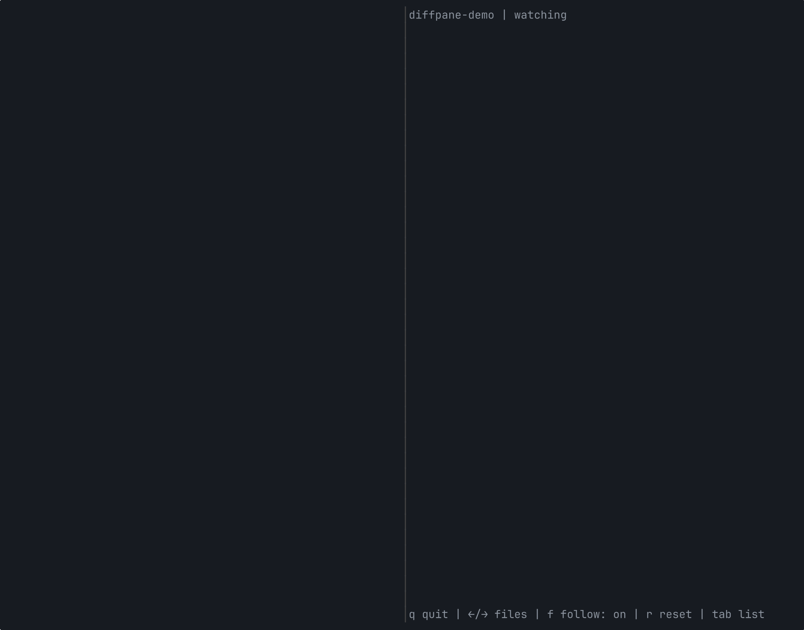

# diffpane

Real-time TUI diff viewer for AI coding agents.



## Why

AI coding agents change files fast, across multiple directories. Without a dedicated viewer, you're left running `git diff` over and over, or trusting changes you haven't seen.

diffpane sits next to your agent and shows every change as it happens. Git is the single source of truth. What you see is what git sees.

## Features

- **Session baseline** - See cumulative changes across your entire session. diffpane records your starting point and diffs everything against it. Press `r` to reset.
- **Follow mode** - Auto-jumps to the latest changed file and scrolls to the newest change. When you navigate manually, follow pauses until you resume it with `f`.
- **Syntax highlighting** - Added and removed lines are color-coded with background colors, so you can tell what changed at a glance. Adapts to dark and light terminals automatically.
- **Zero config** - Single binary, requires only git. Run `diffpane` in any git repo and it works.

## Install

```bash
brew install Astro-Han/tap/diffpane
```

Or with Go:

```bash
go install github.com/Astro-Han/diffpane@latest
```

Pre-built binaries are also available on the [Releases](https://github.com/Astro-Han/diffpane/releases) page.

## Usage

```bash
cd your-project
diffpane
```

Split your terminal. Left pane: your AI agent. Right pane: diffpane.

## Keys

| Key | Action |
|-----|--------|
| `↑`/`↓` | Scroll diff |
| `←`/`→` | Next/prev file |
| `f` | Toggle follow mode |
| `r` | Reset baseline to current HEAD |
| `Tab` | File list |
| `q` | Quit |

## Requirements

- macOS (darwin/amd64 or darwin/arm64)
- Git

## License

MIT
